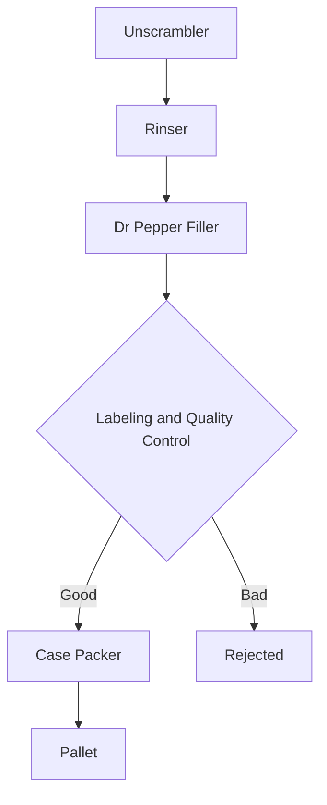

# Dr Pepper Bottle Plant
This is a project for the "Programmering med Java" course (DEV26M). 

The project simulates a Dr Pepper Bottling Plant in java.

## Basic Flow
This chart shows how a bottle gets filled with Dr Pepper in the plant.

