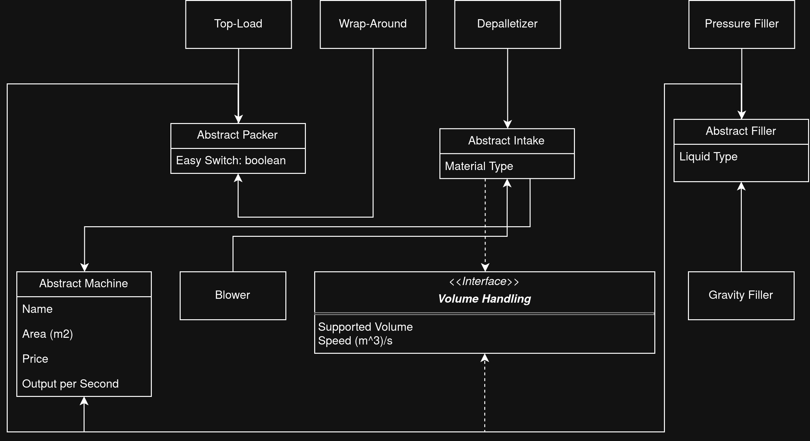

# Dr Pepper Bottle Plant
This is a project for the "Programmering med Java" course (DEV26M). 

The project simulates a Dr Pepper Bottling Plant in java.

## What is the Project About?
Dr Pepper Bottle Plant allows the user to get the best bottling 
machine configuration based on different constraints: price, area 
and output volume.

The program is then able to save configurations to make a 
shopping list.

<!-- TODO: Make a list of commands once the backend structure is decided -->
