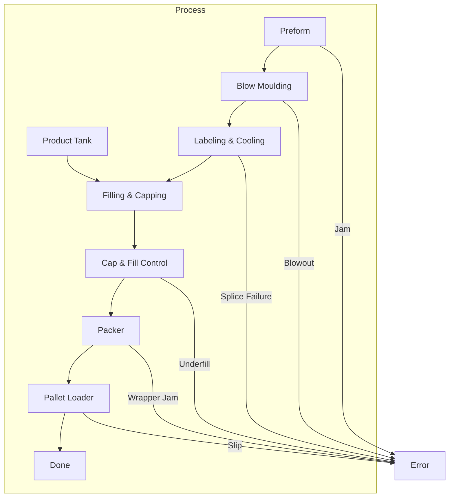

# Dr Pepper Bottle Plant
This is a project for the "Programmering med Java" course (DEV26M). 

The project simulates a Dr Pepper Bottling Plant in java.

For machine inspiration and the bottling lines [Krones website](https://www.krones.com/en/products/bottling-lines-for-pet-containers.php) was used. Krones is a company that specializes in beverage and food packaging machines. This project assumes that water is unlimited and already clean for simplicity purposes. In addition, Krones' more technical documents and specifications are proprietary and not available to the public. So the specifications are simulated with the help of online searches and AI tools, primarily Google Gemini.

## Basic Flow
This chart shows how a bottle gets filled with Dr Pepper in the plant.

This model is, of course, simplified, but it is a good guide over the different steps and the errors I account for.
